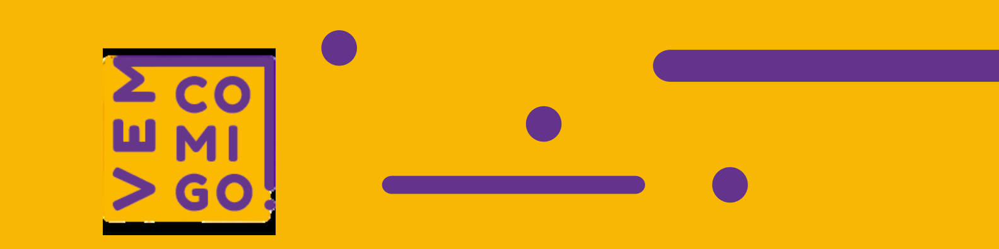

  

# Vem Comigo

**Organização dedicada ao desenvolvimento do site institucional do projeto "Vem Comigo".**  
Nosso objetivo é criar uma plataforma de divulgação que apoie ações contra o bullying e promova a saúde mental nas escolas públicas do Distrito Federal.

---

## 📌 Sobre

O "Vem Comigo" é um projeto educacional realizado em escolas públicas do DF, com foco na conscientização sobre saúde mental, combate ao bullying e promoção do bem-estar entre os estudantes. Através do site, buscamos ampliar o alcance da iniciativa, compartilhando informações, materiais educativos e resultados das ações.

---

## ❓ O que está sendo desenvolvido? *(What)*

Um site de divulgação com:

- Página inicial institucional  
- Seções informativas sobre o projeto  
- Depoimentos e ações realizadas nas escolas    
- Layout responsivo e acessível  
- Identidade visual consistente com a proposta social do projeto

---

## 🎯 Por que este projeto é importante? *(Why)*

- Dar visibilidade a um projeto de impacto social real.  
- Estimular a empatia e o combate ao bullying entre os jovens.  
- Promover o cuidado com a saúde mental dentro do ambiente escolar.  
- Criar um ambiente mais seguro e acolhedor para estudantes da rede pública.

---

## 👤 Para quem é este projeto? *(Who)*

- Estudantes, pais e educadores das escolas públicas do DF  
- Coordenadores pedagógicos e gestores escolares  
- Público em geral interessado em ações de impacto social  

---

## 🌍 Onde está sendo desenvolvido? *(Where)*

- Código-fonte e organização dos repositórios: [GitHub](https://github.com)  
- Protótipos e identidade visual: Figma  
- Documentação do projeto: [`vemcomigo-docs`](https://github.com/seu-usuario/vemcomigo-docs)

---

## 📁 Estrutura de Repositórios

| Repositório           | Descrição                                           |
|-----------------------|-----------------------------------------------------|
| `vemcomigo-frontend`  | Interface web com React e Tailwind CSS              |
| `vemcomigo-backend`   | Integração com banco de dados                       |
| `vemcomigo-assets`    | Logos, imagens, protótipos e recursos visuais       |
| `vemcomigo-docs`      | Documentação do projeto (escopo, planejamento, etc) |

---

<h2 id="autores">Autores</h2>
<table align="center">
    <tr>
        <td align="center">
            <a href="https://github.com/lucas19fonseca">
                
                 
                <b>Lucas Fonseca</b>
            </a>
        <td align="center">
            <a href="https://github.com/PedroDelgo">
                
                 
                <b>Pedro Delgado</b>
            </a>
        </td>
        <td align="center">
            <a href="https://github.com/gabriellima-4">
                
                 
                <b>Gabriel Lima</b>
            </a>
        </td>
             <td align="center">
            <a href="https://github.com/felipethecreator ">
                
                 
                <b>Felipe Rodrigues Queiroz </b>
            </a>
        </td>
    </tr>
</table>

---
## 📬 Contato

Para dúvidas ou sugestões, entre em contato com o responsável técnico do projeto:  
**Pedro César Delgado Gomes** — [LinkedIn](https://www.linkedin.com/in/pedro-c%C3%A9sar-delgado-gomes-7255a7294/)

---
